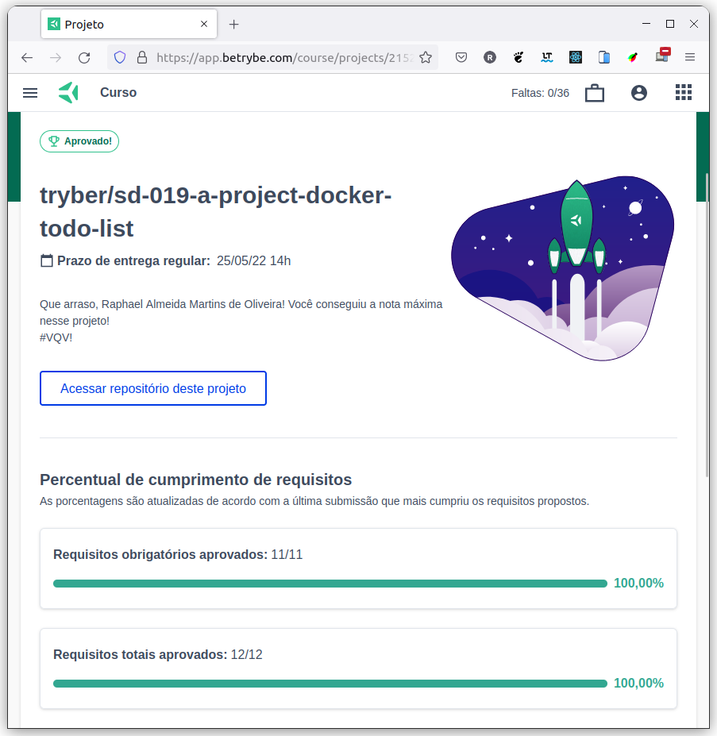

# :whale2: Docker To-Do List :octopus:

## :page_with_curl: About/Sobre

  
<strong>:us: English</strong>
 

Docker project developed by [Raphael Martins](https://www.linkedin.com/in/raphaelameidamartins/) at the end of Unit 19 ([Back-end Development Module](https://github.com/raphaelalmeidamartins/trybe_exercicios/tree/main/3_Desenvolvimento-Back-end)) of Trybe's Web Development course. I was approved with 100% of the mandatory and optional requirements met.

We had to create containers to an already developed full stack application by using docker CLI commands, Dockerfiles and Docker Compose.
 

  
<strong>:brazil: Português</strong>
 

Projeto Docker desenvolvido por [Raphael Martins](https://www.linkedin.com/in/raphaelameidamartins/) ao final do Bloco 19 ([Módulo Desenvolvimento Back-end](https://github.com/raphaelalmeidamartins/trybe_exercicios/tree/main/3_Desenvolvimento-Back-end)) do curso de Desenvolvimento Web da Trybe. Fui aprovado com 100% dos requisitos obrigatórios e opcionais atingidos.

Tivemos que criar containers para uma aplicação full stack que já estava previamente desenvolvida utilizando comandos CLI do docker, Dockerfiles e Docker Compose.
 

## :man_technologist: Developed Skills/Habilidades Desenvolvidas

  
<strong>:us: English</strong>
 

* Create Docker containers for a full stack application
* Use Docker command-line interface (CLI)
* Create images with Dockerfile
* Use Docker Compose
 

  
<strong>:brazil: Português</strong>
 

* Criar componentes Docker para uma aplicação full stack
* Usar a interface de linhas de comando do Docker (CLI)
* Criar imagens com Dockerfile
* Usar o Docker Compose
 

## :hammer_and_wrench: Tools/Ferramentas

* Docker
* Docker Hub
* Docker Compose

## :trophy: Grade/Nota

